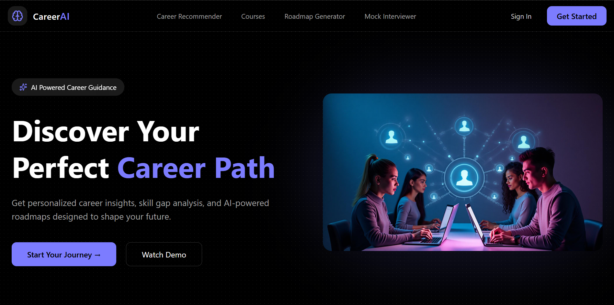
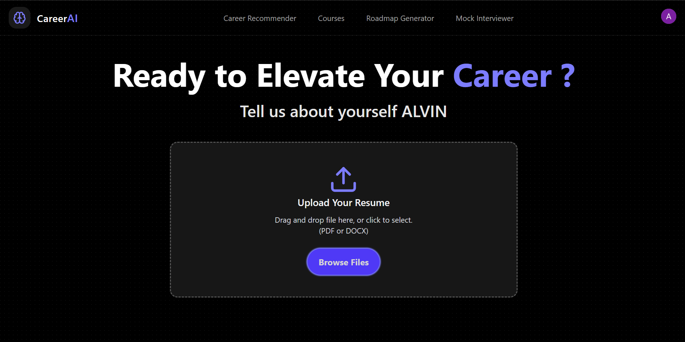
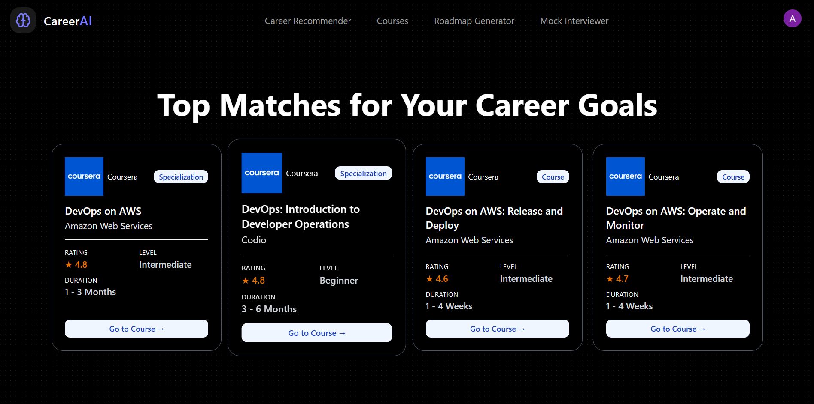
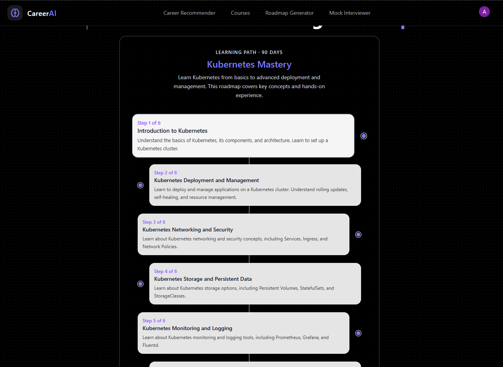
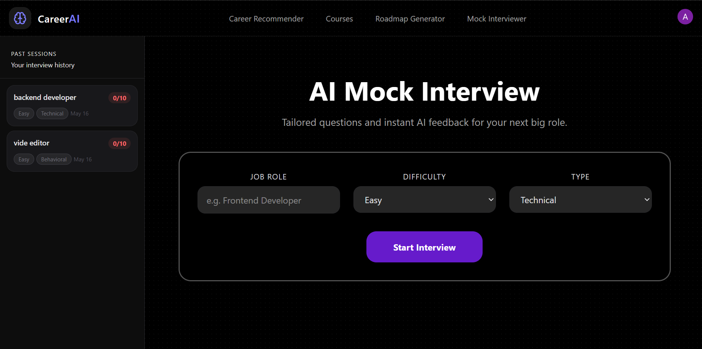
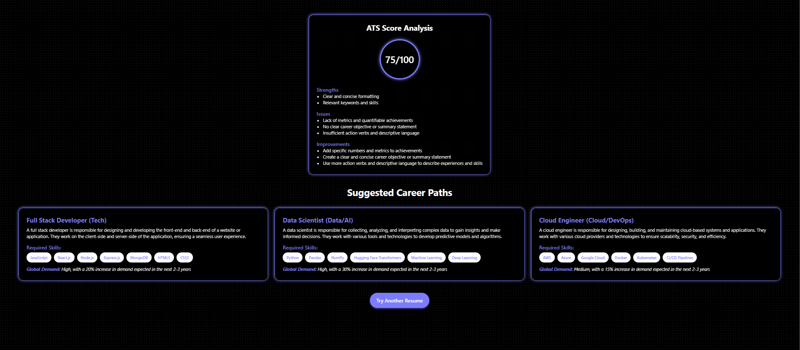

# CareerAI

An AI-powered career guidance platform that helps users analyze resumes, discover personalized learning paths, and practice AI-driven mock interviews — all in one place.

---

## Demo
<div>
    <a href="https://www.loom.com/share/db48d3f9de8c43fc861935b3d82db8ea">
    </a>
    <a href="https://www.loom.com/share/db48d3f9de8c43fc861935b3d82db8ea">
      
    </a>
  </div>
  
## Project Snippets
  
  
  

---

## Features

### 🔍 Resume Analysis & Insights
Upload your resume (PDF) and let the AI analyze your skills, experience, and career profile to recommend suitable career paths, required skills, and industry trends.

### 📚 Course Recommender
Get curated course recommendations aligned with your career goals and skill gaps using vector search and AI-powered matching.

### 🗺️ Roadmap Generator
Generate personalized step-by-step learning roadmaps tailored to your target role and current experience level.

### 🎙️ AI Mock Interview
Practice interviews with AI-generated questions across multiple domains and receive detailed feedback, strengths, weaknesses, and improvement suggestions.

---

## Tech Stack

| Layer | Technologies |
|---|---|
| Frontend | React, Vite, React Router, Tailwind CSS, Clerk |
| Backend (Node.js) | Node.js, Express.js, MongoDB, Clerk SDK |
| Backend (Python) | FastAPI, LangChain, LangGraph, Groq and Gemini LLM, ChromaDB|

---

## Architecture

```text
career-ai/
├── frontend/              # React + Vite application
├── backend/               # Node.js + Express API server
│   └── src/
│       ├── controllers/
│       ├── routes/
│       ├── models/
│       └── server.js
└── server/                # FastAPI Python microservice
    ├── app/
    └── requirements.txt

```

The frontend communicates with the Node.js backend for authentication, interview session management, and data persistence.

Career recommendation, course suggestions, roadmap generation, and interview question/evaluation requests are routed to the FastAPI microservice, which handles resume parsing and LLM inference using LangChain and Groq.

---

## Getting Started

### Prerequisites

- Node.js v18+
- Python 3.10+
- MongoDB instance (Local or Atlas)
- Clerk account
- Groq API key

---

## Installation

### 1. Clone the Repository

```bash
git clone https://github.com/your-username/career-ai.git
cd career-ai
```

---

### 2. Frontend Setup

```bash
cd frontend
npm install
```

Create a `.env` file inside `/frontend`:

```env
VITE_API_BASE_URL=
VITE_CLERK_PUBLISHABLE_KEY=
```

Run the frontend:

```bash
npm run dev
```

---

### 3. Backend Setup (Node.js)

```bash
cd backend
npm install
```

Create a `.env` file inside `/backend`:

```env
PORT=5000
MONGODB_URI=
CLERK_PUBLISHABLE_KEY=
CLERK_SECRET_KEY=
PYTHON_SERVICE_URL=
```

Run the backend:

```bash
npm run dev
```

---

### 4. Python Microservice Setup

```bash
cd server
pip install -r requirements.txt
```

Create a `.env` file inside `/server`:

```env
GROQ_API_KEY=your_groq_api_key
```

Run the FastAPI server:

```bash
uvicorn app.main:app --reload --port 8000
```

---


## Future Improvements

- Voice-based mock interviews
- AI career mentor chatbot
- Job trend analytics dashboard

---

## License

ISC License